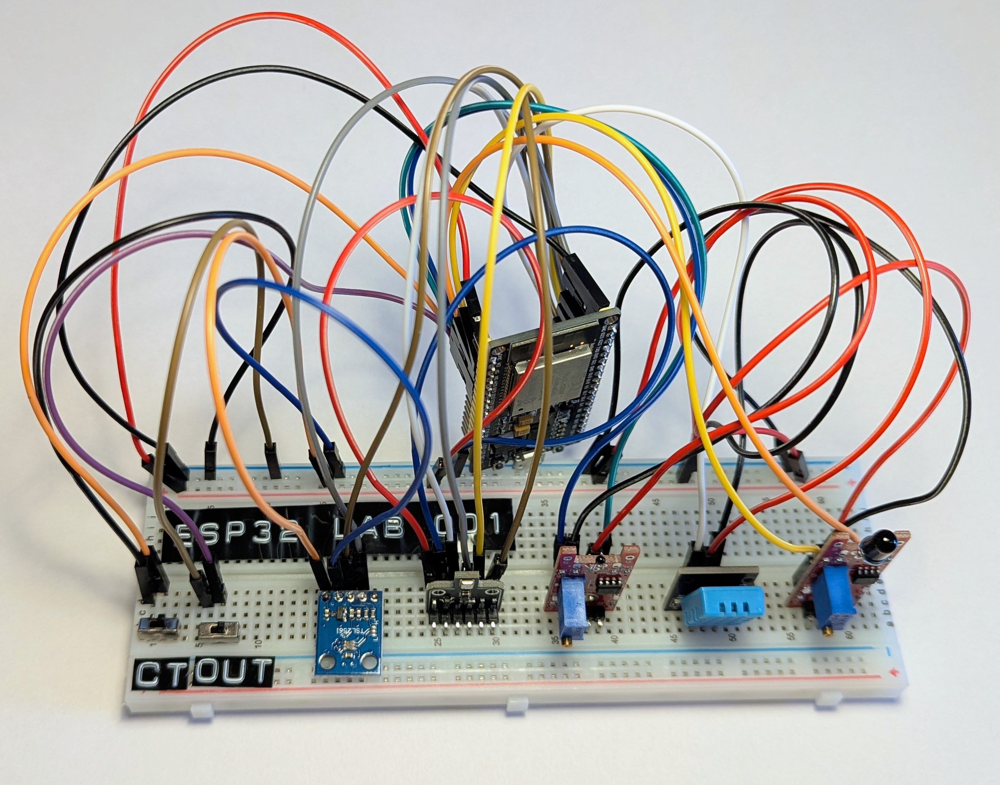

# BCN-2026SSTeamMagenta-Sensiq

Sensiq: Serverless IoT Environmental Monitoring

Sensiq is an end-to-end microcontroller-based Internet of Things (IoT) architecture designed to monitor critical indoor environment quality (IEQ) parameters such as temperature, humidity, light intensity, gas concentration, and flame exposure in real time.

By combining inexpensive ESP32 sensor edge devices with a serverless Amazon Web Services (AWS) cloud backend, Sensiq delivers reliable, low-latency live monitoring alongside cost-efficient historical analytics.

**Key Features:**

- **Edge Node:** ESP32-based multi-sensor array transmitting data via TLS-secured MQTT.
- **Serverless Cloud:** AWS backend for data validation, long-term persistence, and REST API exposure.
- **Web Frontend:** React-based dashboard for visualizing live and historical data without vendor lock-in.
- **Alerting:** Threshold-driven email notifications for critical, safety-relevant events.

## Usage

For usage instructions, please refer to the [usage.md file](USAGE.md) in the root directory of this repository.

## License

The source files are licensed under the MIT License; the documentation is licensed under the Creative Commons Attribution 4.0 International License.

## Code Coverage

The hardware code coverage results can be obtained from ``sys-src/sensiq-hardware/test_output.md``.

The AWS code coverage can be splitted into Python lambda handlers and the AWS infrastructure code.
The Python code coverage results can be obtained from ``sys-src/sensiq-aws/coverage/pytest-lambda-coverage.md``; the Typescript code coverage results using Jest can be found in the ``sys-src/sensiq-aws/coverage/jest-aws-coverage`` directory.
Frontend code coverage results can be found in the ``sys-src/sensiq-frontend/coverage`` directory.

## Hardware Unit

Assembled hardware unit with all sensors and components:


Logical architecture of the hardware unit, see [circuit diagram](sys-doc\kicad-hardware-schematic\circuit_diagram_pdf\kicad-project.pdf).

### Glue Data Catalog

Using the Glue Feature Partition Projection, Athena can automatically calculate the time
paths without needing to load new metadata.

[AWS Glue Docs](https://docs.aws.amazon.com/glue/latest/dg/what-is-glue.html)
[AWS Glue Data Catalog Docs](https://docs.aws.amazon.com/athena/latest/ug/data-sources-glue.html)
[Control Access to AWS Glue Data Catalogs with IAM Policies](https://docs.aws.amazon.com/athena/latest/ug/datacatalogs-iam-policy.html)

### Data Firehose

[AWS Firehose Docs](https://docs.aws.amazon.com/firehose/latest/dev/basic-create.html)

## etc

<!-- # BCN-2026SSTeamMagenta-Sensiq

## Getting started

To make it easy for you to get started with GitLab, here's a list of recommended next steps.

Already a pro? Just edit this README.md and make it your own. Want to make it easy? [Use the template at the bottom](#editing-this-readme)!

## Add your files

* [Create](https://docs.gitlab.com/user/project/repository/web_editor/#create-a-file) or [upload](https://docs.gitlab.com/user/project/repository/web_editor/#upload-a-file) files
* [Add files using the command line](https://docs.gitlab.com/topics/git/add_files/#add-files-to-a-git-repository) or push an existing Git repository with the following command:

```
cd existing_repo
git remote add origin https://git.oth-aw.de/bcssnmagenta26/bcn-2026ssteammagenta-sensiq.git
git branch -M main
git push -uf origin main
```

## Integrate with your tools

* [Set up project integrations](https://git.oth-aw.de/bcssnmagenta26/bcn-2026ssteammagenta-sensiq/-/settings/integrations)

## Collaborate with your team

* [Invite team members and collaborators](https://docs.gitlab.com/user/project/members/)
* [Create a new merge request](https://docs.gitlab.com/user/project/merge_requests/creating_merge_requests/)
* [Automatically close issues from merge requests](https://docs.gitlab.com/user/project/issues/managing_issues/#closing-issues-automatically)
* [Enable merge request approvals](https://docs.gitlab.com/user/project/merge_requests/approvals/)
* [Set auto-merge](https://docs.gitlab.com/user/project/merge_requests/auto_merge/)

## Test and Deploy

Use the built-in continuous integration in GitLab.

* [Get started with GitLab CI/CD](https://docs.gitlab.com/ci/quick_start/)
* [Analyze your code for known vulnerabilities with Static Application Security Testing (SAST)](https://docs.gitlab.com/user/application_security/sast/)
* [Deploy to Kubernetes, Amazon EC2, or Amazon ECS using Auto Deploy](https://docs.gitlab.com/topics/autodevops/requirements/)
* [Use pull-based deployments for improved Kubernetes management](https://docs.gitlab.com/user/clusters/agent/)
* [Set up protected environments](https://docs.gitlab.com/ci/environments/protected_environments/)

***

# Editing this README

When you're ready to make this README your own, just edit this file and use the handy template below (or feel free to structure it however you want - this is just a starting point!). Thanks to [makeareadme.com](https://www.makeareadme.com/) for this template.

## Suggestions for a good README

Every project is different, so consider which of these sections apply to yours. The sections used in the template are suggestions for most open source projects. Also keep in mind that while a README can be too long and detailed, too long is better than too short. If you think your README is too long, consider utilizing another form of documentation rather than cutting out information.

## Name
Choose a self-explaining name for your project.

## Description
Let people know what your project can do specifically. Provide context and add a link to any reference visitors might be unfamiliar with. A list of Features or a Background subsection can also be added here. If there are alternatives to your project, this is a good place to list differentiating factors.

## Badges
On some READMEs, you may see small images that convey metadata, such as whether or not all the tests are passing for the project. You can use Shields to add some to your README. Many services also have instructions for adding a badge.

## Visuals
Depending on what you are making, it can be a good idea to include screenshots or even a video (you'll frequently see GIFs rather than actual videos). Tools like ttygif can help, but check out Asciinema for a more sophisticated method.

## Installation
Within a particular ecosystem, there may be a common way of installing things, such as using Yarn, NuGet, or Homebrew. However, consider the possibility that whoever is reading your README is a novice and would like more guidance. Listing specific steps helps remove ambiguity and gets people to using your project as quickly as possible. If it only runs in a specific context like a particular programming language version or operating system or has dependencies that have to be installed manually, also add a Requirements subsection.

## Usage
Use examples liberally, and show the expected output if you can. It's helpful to have inline the smallest example of usage that you can demonstrate, while providing links to more sophisticated examples if they are too long to reasonably include in the README.

## Support
Tell people where they can go to for help. It can be any combination of an issue tracker, a chat room, an email address, etc.

## Roadmap
If you have ideas for releases in the future, it is a good idea to list them in the README.

## Contributing
State if you are open to contributions and what your requirements are for accepting them.

For people who want to make changes to your project, it's helpful to have some documentation on how to get started. Perhaps there is a script that they should run or some environment variables that they need to set. Make these steps explicit. These instructions could also be useful to your future self.

You can also document commands to lint the code or run tests. These steps help to ensure high code quality and reduce the likelihood that the changes inadvertently break something. Having instructions for running tests is especially helpful if it requires external setup, such as starting a Selenium server for testing in a browser.
## AWS Architecture

AWS architecture diagram:


<!-- TODO: Check if this really exists -->

## React Frontend

Example of the React frontend dashboard:


<!-- TODO: Check if this really exists -->

## Alerting System

An example of an email alert triggered by the alerting system:


<!-- TODO: Update with alerting system details -->

## Authors and acknowledgment

Authors of this repository are Simon Völkl ([s.voelkl2@oth-aw.de](mailto:s.voelkl2@oth-aw.de)), Johannes Schieder ([j.schieder@oth-aw.de](mailto:j.schieder@oth-aw.de)), Sebastian Rosner ([s.rosner@oth-aw.de](mailto:s.rosner@oth-aw.de)), and Andre Tien Vu ([a.vu@oth-aw.de](mailto:a.vu@oth-aw.de)). We would like to thank our professor Dr.-Ing. Christoph Neumann for his support and guidance throughout the project.

Support available for this project is limited. Please feel free to reach out to us via email.
